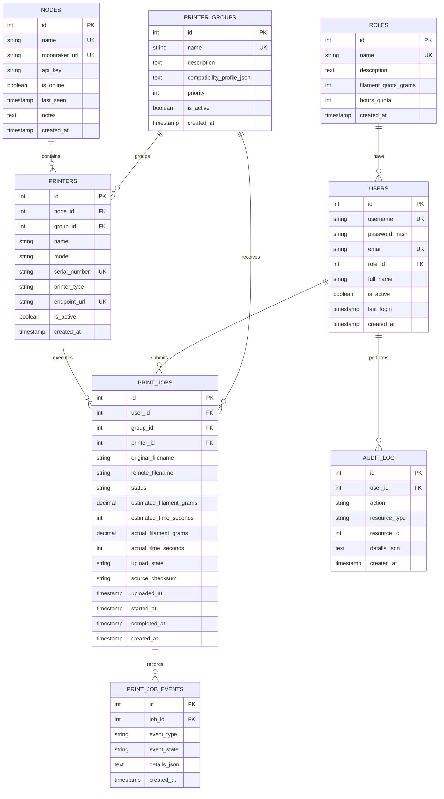

# Esquema mínimo de datos de Fabrik

**Base de datos:** SQLite

**Propósito:** guardar metadatos de la granja, trabajos, consumo y auditoría sin persistir GCODE a largo plazo.

## Principios

- El backend recibe el archivo solo de forma temporal para subirlo a Moonraker.
- Cuando Moonraker confirma la recepción, el binario se elimina.
- La auditoría conserva el evento del trabajo, no el archivo.
- El consumo de horas y filamento se calcula a partir de los trabajos completados.
- La cola prioriza compatibilidad de grupo y luego antigüedad del trabajo.
- El estado operativo de un job y su historial de eventos se guardan por separado.
- La impresora se identifica por su endpoint de Moonraker, no solo por un nombre interno.
- La capa de persistencia debe poderoras y filamento se calcula a partir de los trabajos completados.
- La cola prioriza compatibilidad de grupo y luego antigüedad del trabajo.
- El estado operativo de un job y su historial de eventos se guardan por separado.
- La impresora se identifica por su endpoint de Moonraker, no solo por un nombre interno.
- La capa de persistencia debe poder migrar de SQLite a MySQL/MariaDB sin cambiar el dominio.

## Diagrama ER



## Tablas

### 1. `roles`
Define permisos y cuotas base por tipo de usuario.

- `id` INTEGER, PK
- `name` TEXT, único, por ejemplo `admin`, `profesor`, `estudiante`, `invitado`
- `description` TEXT
- `filament_quota_grams` INTEGER
- `hours_quota` INTEGER
- `created_at` TIMESTAMP

### 2. `users`
Registro de usuarios.

- `id` INTEGER, PK
- `username` TEXT, único
- `password_hash` TEXT
- `email` TEXT, único
- `role_id` INTEGER, FK a `roles.id`
- `full_name` TEXT
- `is_active` BOOLEAN
- `last_login` TIMESTAMP
- `created_at` TIMESTAMP

### 3. `printer_groups`
Agrupa impresoras por specs compatibles.

- `id` INTEGER, PK
- `name` TEXT, único
- `description` TEXT
- `compatibility_profile_json` TEXT con reglas o specs del grupo
- `priority` INTEGER
- `is_active` BOOLEAN
- `created_at` TIMESTAMP

### 4. `nodes`
Nodos con Moonraker/Klipper.

- `id` INTEGER, PK
- `name` TEXT, único
- `moonraker_url` TEXT, único, base del nodo
- `api_key` TEXT
- `is_online` BOOLEAN
- `last_seen` TIMESTAMP
- `notes` TEXT
- `created_at` TIMESTAMP

### 5. `printers`
Impresoras registradas dentro de un nodo y un grupo.

- `id` INTEGER, PK
- `node_id` INTEGER, FK a `nodes.id`
- `group_id` INTEGER, FK a `printer_groups.id`
- `name` TEXT
- `model` TEXT
- `serial_number` TEXT, único cuando exista
- `printer_type` TEXT
- `endpoint_url` TEXT, único, endpoint real de Moonraker para esa impresora
- `is_active` BOOLEAN
- `created_at` TIMESTAMP

### 6. `print_jobs`
Historial y estado de cada impresión.

- `id` INTEGER, PK
- `user_id` INTEGER, FK a `users.id`
- `group_id` INTEGER, FK a `printer_groups.id`
- `printer_id` INTEGER, FK a `printers.id`, nullable mientras está en cola
- `original_filename` TEXT
- `remote_filename` TEXT
- `status` TEXT: `pending`, `uploading`, `queued`, `printing`, `completed`, `failed`, `cancelled`
- `estimated_filament_grams` REAL
- `estimated_time_seconds` INTEGER
- `actual_filament_grams` REAL
- `actual_time_seconds` INTEGER
- `upload_state` TEXT: `temporary`, `uploaded`, `deleted`
- `source_checksum` TEXT
- `uploaded_at` TIMESTAMP
- `started_at` TIMESTAMP
- `completed_at` TIMESTAMP
- `created_at` TIMESTAMP

### 7. `print_job_events`
Historial append-only de cambios de estado y eventos operativos del job.

- `id` INTEGER, PK
- `job_id` INTEGER, FK a `print_jobs.id`
- `event_type` TEXT, por ejemplo `created`, `uploaded`, `assigned`, `started`, `paused`, `resumed`, `completed`, `failed`, `cancelled`
- `event_state` TEXT, estado operativo asociado al evento
- `details_json` TEXT
- `created_at` TIMESTAMP

### 8. `audit_log`
Eventos de trazabilidad.

- `id` INTEGER, PK
- `user_id` INTEGER, FK a `users.id`
- `action` TEXT
- `resource_type` TEXT
- `resource_id` INTEGER
- `details_json` TEXT
- `created_at` TIMESTAMP

## Índices sugeridos

```sql
CREATE INDEX idx_printers_node_id ON printers(node_id);
CREATE INDEX idx_printers_group_id ON printers(group_id);
CREATE INDEX idx_print_jobs_user_id ON print_jobs(user_id);
CREATE INDEX idx_print_jobs_group_id ON print_jobs(group_id);
CREATE INDEX idx_print_jobs_printer_id ON print_jobs(printer_id);
CREATE INDEX idx_print_jobs_status ON print_jobs(status);
CREATE INDEX idx_print_job_events_job_id ON print_job_events(job_id);
CREATE INDEX idx_print_job_events_created_at ON print_job_events(created_at);
CREATE INDEX idx_audit_log_user_id ON audit_log(user_id);
CREATE INDEX idx_audit_log_created_at ON audit_log(created_at);
```

## Notas de diseño

- No hay tabla para guardar GCODE de forma permanente.
- El consumo mensual puede calcularse desde `print_jobs` y materializarse más adelante si hace falta.
- Si la operación crece, el primer cambio natural sería separar lecturas analíticas, no cambiar la lógica del scheduler.
- `print_job_events` sirve para evitar que la tabla principal de jobs se vuelva un historial gigante.
- Si se migra a MySQL/MariaDB, conviene mantener la misma estructura de tablas y solo cambiar el driver y la cadena de conexión.
- Para evitar reescrituras, la capa de acceso a datos debería construirse con ORM + migraciones, no con SQL disperso en la app.
- Recomendación mínima de dependencias de persistencia: `SQLAlchemy`, `Alembic` y un driver del motor elegido (`pymysql` o `mysqlclient`).