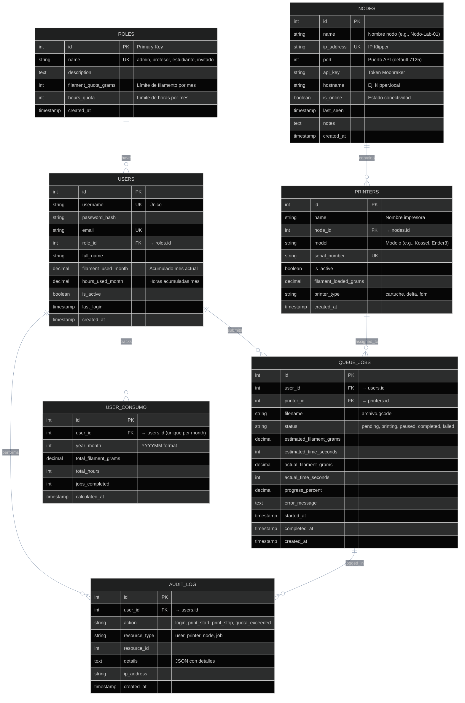

# PrintRobot Database Schema

**Base de datos:** SQLite (archivo: `data/fabrik.db`)

**Propósito:** Esquema de bases de datos para sistema de orquestación de granjas de impresoras 3D con Klipper/Moonraker.

---

## Diagrama ER (Entity-Relationship)



---

## Tablas Detalladas

### 1. **ROLES**
Control de acceso basado en roles. Define permisos y cuotas.

| Campo | Tipo | Restricciones | Descripción |
|-------|------|---------------|-------------|
| `id` | INTEGER | PK | Identificador único |
| `name` | VARCHAR(50) | UQ | `admin`, `profesor`, `estudiante`, `invitado` |
| `description` | TEXT | | Descripción del rol |
| `filament_quota_grams` | INTEGER | | Límite mensual de filamento (gramos) |
| `hours_quota` | INTEGER | | Límite mensual de horas |
| `created_at` | TIMESTAMP | DEFAULT NOW | Fecha de creación |

**Valores iniciales:**
```
- admin: sin límites
- profesor: 5000g/mes, 100h/mes
- estudiante: 2000g/mes, 50h/mes
- invitado: 500g/mes, 10h/mes
```

---

### 2. **USERS**
Registro de usuarios del sistema.

| Campo | Tipo | Restricciones | Descripción |
|-------|------|---------------|-------------|
| `id` | INTEGER | PK | Identificador único |
| `username` | VARCHAR(50) | UQ, NOT NULL | Login único |
| `password_hash` | VARCHAR(255) | NOT NULL | Hash bcrypt (nunca texto plano) |
| `email` | VARCHAR(100) | UQ | Email de contacto |
| `role_id` | INTEGER | FK→roles.id | Rol del usuario |
| `full_name` | VARCHAR(100) | | Nombre completo |
| `filament_used_month` | DECIMAL(10,2) | DEFAULT 0 | Consumo acumulado (mes actual) |
| `hours_used_month` | DECIMAL(10,2) | DEFAULT 0 | Horas acumuladas (mes actual) |
| `is_active` | BOOLEAN | DEFAULT TRUE | Cuenta activa/desactivada |
| `last_login` | TIMESTAMP | | Último acceso |
| `created_at` | TIMESTAMP | DEFAULT NOW | Fecha de creación |

---

### 3. **NODES**
Hosts Klipper con API Moonraker.

| Campo | Tipo | Restricciones | Descripción |
|-------|------|---------------|-------------|
| `id` | INTEGER | PK | Identificador único |
| `name` | VARCHAR(100) | NOT NULL | Nombre descriptivo (ej. `Nodo-Lab-01`) |
| `ip_address` | VARCHAR(15) | UQ, NOT NULL | Dirección IP o hostname |
| `port` | INTEGER | DEFAULT 7125 | Puerto API Moonraker |
| `api_key` | VARCHAR(255) | | Token de autenticación (opcional para MVP) |
| `hostname` | VARCHAR(100) | | Hostname DNS (ej. `klipper.local`) |
| `is_online` | BOOLEAN | DEFAULT FALSE | Estado conectividad (polling) |
| `last_seen` | TIMESTAMP | | Último latido recibido |
| `notes` | TEXT | | Notas administrativas |
| `created_at` | TIMESTAMP | DEFAULT NOW | Fecha de creación |

---

### 4. **PRINTERS**
Impresoras 3D registradas en nodos.

| Campo | Tipo | Restricciones | Descripción |
|-------|------|---------------|-------------|
| `id` | INTEGER | PK | Identificador único |
| `name` | VARCHAR(100) | NOT NULL | Nombre impresora (ej. `Kossel-01`) |
| `node_id` | INTEGER | FK→nodes.id | Nodo que contiene esta impresora |
| `model` | VARCHAR(50) | | Modelo (ej. `Kossel`, `Ender3 V2`) |
| `serial_number` | VARCHAR(50) | UQ | Serial (si disponible) |
| `is_active` | BOOLEAN | DEFAULT TRUE | Disponible para usar |
| `filament_loaded_grams` | DECIMAL(10,2) | DEFAULT 0 | Filamento cargado actual |
| `printer_type` | VARCHAR(20) | | `cartuche`, `delta`, `fdm`, etc. |
| `created_at` | TIMESTAMP | DEFAULT NOW | Fecha de creación |

---

### 5. **QUEUE_JOBS**
Cola de trabajos de impresión.

| Campo | Tipo | Restricciones | Descripción |
|-------|------|---------------|-------------|
| `id` | INTEGER | PK | Identificador único |
| `user_id` | INTEGER | FK→users.id | Usuario que envió el trabajo |
| `printer_id` | INTEGER | FK→printers.id | Impresora asignada |
| `filename` | VARCHAR(255) | NOT NULL | Nombre archivo GCODE |
| `status` | VARCHAR(20) | DEFAULT `pending` | Estados: `pending`, `printing`, `paused`, `completed`, `failed` |
| `estimated_filament_grams` | DECIMAL(10,2) | | Predicción filamento |
| `estimated_time_seconds` | INTEGER | | Tiempo estimado (segundos) |
| `actual_filament_grams` | DECIMAL(10,2) | | Filamento utilizado (final) |
| `actual_time_seconds` | INTEGER | | Tiempo real (segundos) |
| `progress_percent` | DECIMAL(5,2) | DEFAULT 0 | Progreso (0-100%) |
| `error_message` | TEXT | | Detalle de error (si aplica) |
| `started_at` | TIMESTAMP | | Cuándo comenzó la impresión |
| `completed_at` | TIMESTAMP | | Cuándo finalizó |
| `created_at` | TIMESTAMP | DEFAULT NOW | Cuando se envió |

---

### 6. **USER_CONSUMO**
Totales de consumo por usuario y mes (para auditoría y cuotas).

| Campo | Tipo | Restricciones | Descripción |
|-------|------|---------------|-------------|
| `id` | INTEGER | PK | Identificador único |
| `user_id` | INTEGER | FK→users.id | Usuario |
| `year_month` | INTEGER | UQ(user_id) | Formato YYYYMM (ej. 202604) |
| `total_filament_grams` | DECIMAL(10,2) | DEFAULT 0 | Total mes |
| `total_hours` | DECIMAL(10,2) | DEFAULT 0 | Total horas |
| `jobs_completed` | INTEGER | DEFAULT 0 | Cantidad trabajos exitosos |
| `calculated_at` | TIMESTAMP | DEFAULT NOW | Cuando se calculó |

---

### 7. **AUDIT_LOG**
Registro de acciones para auditoría y diagnóstico.

| Campo | Tipo | Restricciones | Descripción |
|-------|------|---------------|-------------|
| `id` | INTEGER | PK | Identificador único |
| `user_id` | INTEGER | FK→users.id | Usuario que realizó la acción |
| `action` | VARCHAR(50) | | `login`, `print_start`, `print_stop`, `quota_exceeded`, `node_offline` |
| `resource_type` | VARCHAR(20) | | `user`, `printer`, `node`, `job` |
| `resource_id` | INTEGER | | ID del recurso afectado |
| `details` | TEXT | | JSON con datos adicionales |
| `ip_address` | VARCHAR(15) | | IP origen (para seguridad) |
| `created_at` | TIMESTAMP | DEFAULT NOW | Timestamp de la acción |

---

## Índices Sugeridos

```sql
-- Performance queries frecuentes
CREATE INDEX idx_users_role_id ON users(role_id);
CREATE INDEX idx_queue_jobs_user_id ON queue_jobs(user_id);
CREATE INDEX idx_queue_jobs_printer_id ON queue_jobs(printer_id);
CREATE INDEX idx_queue_jobs_status ON queue_jobs(status);
CREATE INDEX idx_printers_node_id ON printers(node_id);
CREATE INDEX idx_user_consumo_year_month ON user_consumo(year_month);
CREATE INDEX idx_audit_log_user_id ON audit_log(user_id);
CREATE INDEX idx_audit_log_created_at ON audit_log(created_at);
```

---

## Notas de Implementación

### Ciclo 0 (MVP)
- ✅ Tablas roles, users (sin auth aún)
- ✅ Tablas nodes, printers
- ✅ Tabla queue_jobs (básica)
- ⏳ Auditoría simple (sin audit_log)

### Ciclo 1
- ✅ Autenticación JWT completa
- ✅ Cuotas y consumo integrado
- ✅ Audit log completo
- ✅ Sincronización automática de consumo

### Ciclo 2+
- Replicación de BD (SQLite → PostgreSQL si escala)
- Versionado más granular (user_consumo por dia)
- Eventos WebSocket para actualizaciones en vivo

---

## Cambios Futuros (Fáciles de Tracear)

Cualquier cambio se documenta antes aquí. Ejemplo:

- **[To Do] Agregar campo `maintenance_notes` en PRINTERS**
  - Razón: Rastrear mantenimiento preventivo
  - Ciclo: 2
  - Migración: ALTER TABLE printers ADD COLUMN maintenance_notes TEXT

- **[Done] Agregar campo `webhook_url` en NODES**
  - Realizado en Ciclo 0.3
  - Migración: `alembic revision --autogenerate`

---

**Última actualización:** 20 de abril de 2026  
**Version:** 0.1.0 (Ciclo 0)
